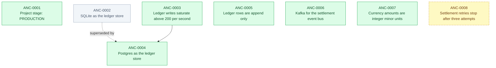

# Worked example: a payments ledger service

A small, realistic set of anchors for a service that has been running long enough to
have made mistakes. Nothing here is a toy: every anchor is the kind of thing a team
actually re-argues when the person who decided it has moved on.

Run the commands below from this directory. It is a real project as far as Cairn is
concerned — `examples/` is treated as holding separate projects, so this one has its
own `.cairn/` without conflicting with the repository around it.

## What each anchor is doing

| Anchor | Type | Why it is here |
|---|---|---|
| ANC-0001 | `STAGE` | The project is in production, which changes what trade-offs are acceptable. |
| ANC-0002 | `DECISION` | The original store. Now `SUPERSEDED` — kept, not deleted, because the reasoning still explains the shape of the code. |
| ANC-0003 | `FINDING` | The measurement that made the original decision wrong. Not a decision itself. |
| ANC-0004 | `DECISION` | Supersedes ANC-0002 and depends on ANC-0003. Carries two rejected alternatives and a `revisit_if`. |
| ANC-0005 | `CONSTRAINT` | Carries a `verify` command, so the rule is checked rather than merely written down. |
| ANC-0006 | `REJECTED_PATH` | Actually tried and abandoned. Different from a rejected alternative, which was only considered. |
| ANC-0007 | `CONSTRAINT` | Project-wide, so it applies to every path. |
| ANC-0008 | `DECISION` | Still `PROPOSED`. Drafted but not binding until a person promotes it. |

## The decision graph

Regenerated with `cairn timeline --format mermaid`, and rendered by GitHub directly.



## Things to try

**What governs this directory?**

```
cairn why src/ledger
```

Leads with the anchors scoped to that path, then the project-wide ones. The reasoning
travels with each rule, so an agent arguing against a constraint has to argue with why
it exists.

**Why was this decided, and what did it beat?**

```
cairn show ANC-0004
```

Prints the alternatives that were passed over. Without those, a decision cannot
honestly be reopened later: there is nothing recorded to reconsider.

**What has changed over time?**

```
cairn timeline
```

The narrative is reconstructed from the anchors, never written by hand. Nobody
authored a history; the dates, types and supersession links already were one.

**Is anything still true?**

```
cairn check --allow-verify
```

ANC-0005 carries a shell command asserting no `UPDATE` or `DELETE` reaches the ledger
tables. Add one to `src/ledger/entries.sql` and the check fails. Verify commands never
run without that flag, because a repository must not be able to make cloning it an act
of trust.

**What needs a second look?**

```
cairn review
```

Surfaces ANC-0004's `revisit_if` condition, and any scope whose code has moved a long
way since its anchor was written.
